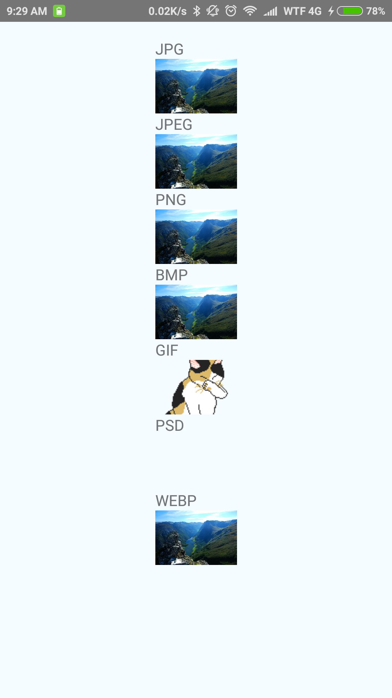
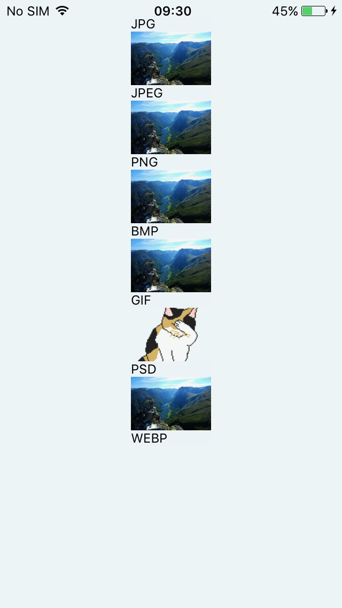

## react-native-image-format-test

Testing the image component for supported image formats on Android and iOS.

Picture credits:
```
"Nærøyfjorden, Norway - from Breiskrednosi. UNESCO World Heritage"
Image Author: Kjetil Birkeland Moe
```

Notes:
```
React-native version: 0.44.0
fresco version: 1.0.1
```

#### Devices
Real life device information used to test and get screenshots
##### Android
```
Device: Xiaomi mi5s
ROM: MIUI 8.2.4.0 Stable
Android: 6.0.1
```



##### iOS
```
Device: iPhone 5s
iOS version: 10.3.1
```


